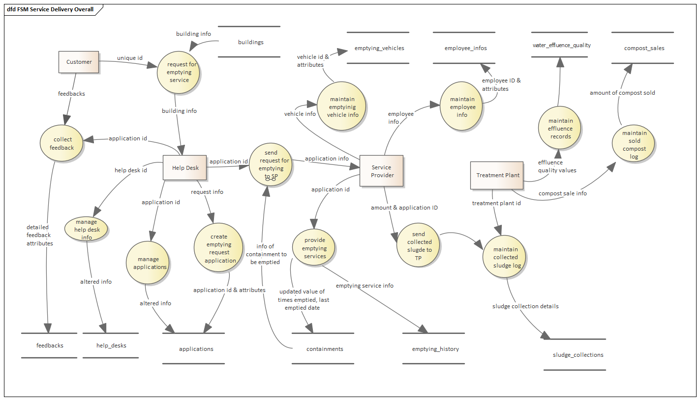
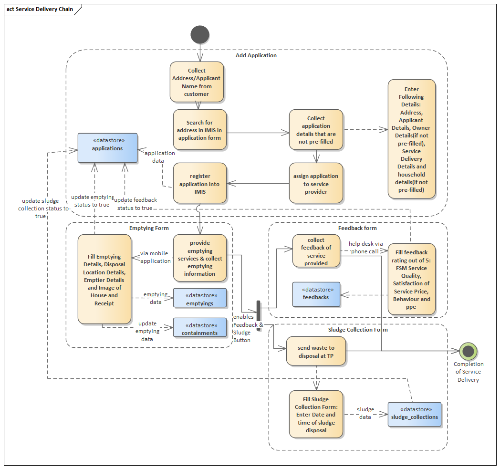
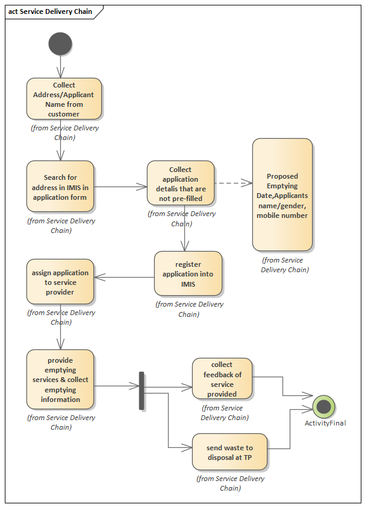

Version: V1.0.0

# Fecal Sludge IMS

## UML Diagram

Service Delivery Chain DFD Level 1

Service Delivery Chain

## FSM Dashboard

The dashboard utilizes the following tools to deliver data and insights:

-   Charts: Created with Chart.js for visual representation of trends.
-   Cards: Built with Bootstrap, HTML, and CSS.
-   Icons: SVG and Font Awesome.

### Data Retrieval

-   Controller: The FsmDashboardController (located at app\\Http\\Controllers\\Fsm) initiates data fetching. Clear code comments within the controller aid in understanding this process.
-   Service Class: The FsmDashboardService (located at app\\Services\\Fsm) has been called by controller to perform necessary operations.

Count Boxes

-   Data Fetching: Laravel Eloquent retrieves data for count boxes (potentially using database queries.
-   Filtering: Specific count boxes can be filtered by year, enabling users to narrow down the displayed data.

Charts

-   Data Fetching: Laravel Eloquent & Raw SQL queries are used to fetch data for charts.
    1.  Views

Layout

The core dashboard structure is defined in the resources\\views\\dashboard\\fsmDashboard.blade.php file. This file acts as the overall layout and likely includes placeholders for the various components.

Components

Count boxes and charts are incorporated as separate components within the layout:

Count boxes are fetched from resources\\views\\dashboard\\countBox.

Charts are fetched from resources\\views\\dashboard\\charts.

## Containment IMS

The containment module encompasses one major sub modules:

-   Containment

### Tables

The Containment Sub Module uses the following tables:

-   containments: stores primary information of the building
-   Build_contains: relational database that connects buildings and containments. Foreign Key: bin and containment_id.
-   Sanitation_system_types: stores sanitation system types attributes used as dropdowns

The corresponding tables have their respective models that are named in Pascal Case in singluar form. The containment info modules are located at app\\Http\\Models\\Fsm.

### Views

All views used by this module is stored in resources\\views\\building-info

-   containments.create: opens form and calls partial-form for form content
-   containments.edit: opens form and calls partial-form for form contents
-   containments.history: lists all past edits of the record
-   containments.index: lists containments records
-   containment.list-containments: list all containments connected to building
-   containments.listBuilding: lists all buildings connected to that containment.
-   containments.partial-form: creates form content for addition of new containment or edit containment of existing building
-   containments.show: displays all attributes of particular record
-   containments.type-change: displays the history of type attribute of containment

The models contain the connection between the model and the table defined by

*\$table = ‘schema_name.table_name’* as well as the primary key defined by

*primaryKey= ‘primary_key_field’*

For history functionality, the revisionCreationsEnabled is set true and we

-   use RevisionableTrait(use Venturecraft\\Revisionable\\RevisionableTrait;

For soft deletes functionality, we

-   use SoftDeletes;(use Illuminate\\Database\\Eloquent\\SoftDeletes;)

For Setting belongsTo and HasMany relationships, we:

-   use Illuminate\\Database\\Eloquent\\Relations\\BelongsTo;
-   belongsToMany('model_relative_path', 'relational_table', primary_key, 'primary_key of relationship')
-   belongsTo('model_name', 'pk of first table', 'pk of Second table'
-   use Illuminate\\Database\\Eloquent\\Relations\\HasMany;

### Models

Location: app\\Models\\Fsm\\Containment.php

There are multiple relationships defined in the Containment Model. They are:

buildings: belongsToMany relationship (n to n relationship)

emptyingService: hasMany relationship with applications

### ContainmentController

Controller: app\\Http\\Controllers\\Fsm\\ContainmentController.php

The controller’s main function is to provide the connection between the calling route and its subsequent function written in the Service Class.

The basic classes of the controller are:

| **Function**    | \__construct()                                                         |
|-----------------|------------------------------------------------------------------------|
| **Description** | Initializes authentication, permissions and the service class instance |
| **Parameters**  | Service class instance(ContainmentService)                             |
| **Return**      | null                                                                   |
| **Source**      | app\\Http\\Controllers\\Fsm\\ContainmentController.php                 |

| **Function**    | index()                                                                      |
|-----------------|------------------------------------------------------------------------------|
| **Description** | Returns the index.blade.php page with dropdown values fetched from database. |
| **Parameters**  | null                                                                         |
| **Return**      | fsm.containments.index compact('page_title')                                 |
| **Source**      | app\\Http\\Controllers\\Fsm\\ContainmentController.php                       |

| **Function**    | createContainment()                                                                                                                                                                              |
|-----------------|--------------------------------------------------------------------------------------------------------------------------------------------------------------------------------------------------|
| **Description** | Returns the form to create new containment with dropdown values fetched from the database.                                                                                                       |
| **Parameters**  | null                                                                                                                                                                                             |
| **Return**      | ('fsm.containments.create', compact('page_title','id','multiple_bin'))                                                                                                                           |
| **Source**      | app\\Http\\Controllers\\Fsm\\ContainmentController.php                                                                                                                                           |
| **Remarks**     | This function handles the situation where only containment is created by associating it with a building before hand. In situations where an existing building is connected to a new containment. |

| **Function**    | storeContainment()                                                           |
|-----------------|------------------------------------------------------------------------------|
| **Description** | Calls the service class that handles the process of storing containment data |
| **Parameters**  | ContainmentRequest \$request                                                 |
| **Return**      | Success or error message.                                                    |
| **Source**      | app\\Http\\Controllers\\Fsm\\ContainmentController.php                       |
| **Remarks**     | storeContainmentData(\$request) Service Class Function Name                  |

| **Function**    | show()                                                                  |
|-----------------|-------------------------------------------------------------------------|
| **Description** | Returns the page displaying individual containment data                 |
| **Parameters**  | \$id                                                                    |
| **Return**      | fsm.containments.show  compact('page_title', 'containment','building')  |
| **Source**      | app\\Http\\Controllers\\Fsm\\ContainmentController.php                  |

| **Function**    | edit()                                                                                 |
|-----------------|----------------------------------------------------------------------------------------|
| **Description** | Returns the edit form page displaying pre-existing individual containment data as well |
| **Parameters**  | \$id                                                                                   |
| **Return**      | fsm.containments.edit  ompact('page_title','containment')                              |
| **Source**      | app\\Http\\Controllers\\Fsm\\ContainmentController.php                                 |

| **Function**    | update()                                                                      |
|-----------------|-------------------------------------------------------------------------------|
| **Description** | Calls the service class that handles the process of updating containment data |
| **Parameters**  | ContainmentRequest \$request                                                  |
| **Return**      | Success or error message.                                                     |
| **Source**      | app\\Http\\Controllers\\Fsm\\ContainmentController.php                        |
| **Remarks**     | updateContainmentData(\$request, \$id) (service class function)               |

| **Function**    | destroy()                                                                    |
|-----------------|------------------------------------------------------------------------------|
| **Description** | Soft deletes containment information if it is not connected to any buildings |
| **Parameters**  | \$id                                                                         |
| **Return**      |                                                                              |
| **Source**      | app\\Http\\Controllers\\Fsm\\ContainmentController.php                       |
| **Remarks**     | Button present in the actions column of the fsm.containments.index page      |

| **Function**    | export()                                                                       |
|-----------------|--------------------------------------------------------------------------------|
| **Description** | Calls the service class that handles the process of exporting containment data |
| **Parameters**  |                                                                                |
| **Return**      | CSV file containing containment data                                           |
| **Source**      | app\\Http\\Controllers\\Fsm\\ContainmentController.php                         |
| **Remarks**     | getExport() (service class function)                                           |

| **Function**    | exportBuildingContainment()                                                                       |
|-----------------|--------------------------------------------------------------------------------|
| **Description** | Calls the service class that handles the process of exporting building connected with containment data |
| **Parameters**  |                                                                                |
| **Return**      | CSV file containing containment data                                           |
| **Source**      | app\\Http\\Controllers\\Fsm\\ContainmentController.php                         |
| **Remarks**     | getExportBuildingContainment() (service class function)                                           |

| **Function**    | listBuildings()                                                                                          |
|-----------------|----------------------------------------------------------------------------------------------------------|
| **Description** | Calls the service class that handles the process of fetching all buildings connected to that containment |
| **Parameters**  |                                                                                                          |
| **Return**      | fsm.containments.listBuilding', compact('page_title', 'containment', 'buildings')                        |
| **Source**      | app\\Http\\Controllers\\Fsm\\ContainmentController.php                                                   |
| **Remarks**     |                                                                                                          |

| **Function**    | deleteBuilding()                                                                       |
|-----------------|----------------------------------------------------------------------------------------|
| **Description** | This code manages the deletion of a containment and its connection to a building while ensuring data integrity. It checks if the containment or building has active applications (with incomplete emptying) and prevents deletion if such applications exist. If no active applications are found, it removes the connection, updates the sewer/drain codes for the building if there are no remaining connections, and deletes the containment if it has no other connections. The process uses a database transaction for consistency and provides user feedback based on the outcome..                         |
| **Parameters**  | \$id, \$bin                                                                            |
| **Return**      |                                                                                        |
| **Source**      | app\\Http\\Controllers\\Fsm\\ContainmentController.php                                 |
| **Remarks**     | Button present in the page: containments.listBuildings and buildings.edit-partial-form |

### ContainmentService

Location: app\\Services\\Fsm\\ContainmentService.php

The Service Class contains all the business logic. It contains all the functions that are being called in the ContainmentController.

| **Function**    | fetchData()                                                                                                                                                                                                                                   |
|-----------------|-----------------------------------------------------------------------------------------------------------------------------------------------------------------------------------------------------------------------------------------------|
| **Description** | Handles the process of fetching containment data for data tables                                                                                                                                                                              |
| **Parameters**  | \$request                                                                                                                                                                                                                                     |
| **Return**      | Returns data of containment table for datatables                                                                                                                                                                                              |
| **Source**      | app\\Services\\Fsm\\ContainmentService.php                                                                                                                                                                                                    |
| **Logic**       | Join required tables Check for filter values if any. Filter accordingly.  Filter values are defined in the script of the index page Append actions column that contain buttons such as edit, delete, show, history and so on Return datatable |
| **Remarks**     | This function is called by the datatables displayed in the containment.index page                                                                                                                                                             |

| **Function**    | fetchBuildingContainmentData()                                                                                                                                                                                                                |
|-----------------|-----------------------------------------------------------------------------------------------------------------------------------------------------------------------------------------------------------------------------------------------|
| **Description** | Handles the process of fetching containment data for data tables                                                                                                                                                                              |
| **Parameters**  | \$request                                                                                                                                                                                                                                     |
| **Return**      | Returns data of particular containments connected to selected building table for datatables                                                                                                                                                   |
| **Source**      | app\\Services\\Fsm\\ContainmentService.php                                                                                                                                                                                                    |
| **Logic**       | Join required tables Check for filter values if any. Filter accordingly.  Filter values are defined in the script of the index page Append actions column that contain buttons such as edit, delete, show, history and so on Return datatable |
| **Remarks**     | This function is called by the datatables displayed in the buildings.edit-form page                                                                                                                                                           |

| **Function**    | storeContainmentData()                                                                                                                                                                                                                                                                                                                                                                                                                                                                                                                                                                                                                                                                                                                                    |
|-----------------|-----------------------------------------------------------------------------------------------------------------------------------------------------------------------------------------------------------------------------------------------------------------------------------------------------------------------------------------------------------------------------------------------------------------------------------------------------------------------------------------------------------------------------------------------------------------------------------------------------------------------------------------------------------------------------------------------------------------------------------------------------------|
| **Description** | Handles the process of adding new containment to an existing building.                                                                                                                                                                                                                                                                                                                                                                                                                                                                                                                                                                                                                                                                                    |
| **Parameters**  | \$request                                                                                                                                                                                                                                                                                                                                                                                                                                                                                                                                                                                                                                                                                                                                                 |
| **Return**      | Success or error message, stores data to containments.                                                                                                                                                                                                                                                                                                                                                                                                                                                                                                                                                                                                                                                                                                    |
| **Source**      | app\\Services\\Fsm\\ContainmentService.php                                                                                                                                                                                                                                                                                                                                                                                                                                                                                                                                                                                                                                                                                                                |
| **Logic**       | Assings passed if to bin. Checks if multiple_bin field is not empty( this field will not be empty if the containment is already present in the system and is being used by some other building. If yes, creates new BuildContain, fetches containment_id of connected containment with the building Creates connection between existing containment and building If no, Finds the building to which new containment is being added and fetches its geom Creates new containment id and containment model Stores required information in said model If geom is present, calculates centroid from given geom and stores it in geom field of containment model Creates BuildContain connection between newly created containment and pre-existing building.  |

| **Function**    | updateContainmentData(\$request, \$id)                                                                                                                                                                                                                                      |
|-----------------|-----------------------------------------------------------------------------------------------------------------------------------------------------------------------------------------------------------------------------------------------------------------------------|
| **Description** | Handles the process of update containment information.                                                                                                                                                                                                                      |
| **Parameters**  | \$request, \$id                                                                                                                                                                                                                                                             |
| **Return**      | Success or error message, updates data to containments.                                                                                                                                                                                                                     |
| **Source**      | app\\Services\\Fsm\\ContainmentService.php                                                                                                                                                                                                                                  |
| **Logic**       | Similar to addition of containment. Only major difference is multiple_bin field is absent. All information previously present in the database are displayed in the fields.  Same information is restored into the database, according to logic of additing new containment  |

| **Function**    | getExport()                                                                                                                                                                                                                                                                                                                                                                                                                              |
|-----------------|------------------------------------------------------------------------------------------------------------------------------------------------------------------------------------------------------------------------------------------------------------------------------------------------------------------------------------------------------------------------------------------------------------------------------------------|
| **Description** | Handles the process of exporting containment information                                                                                                                                                                                                                                                                                                                                                                                 |
| **Parameters**  |                                                                                                                                                                                                                                                                                                                                                                                                                                          |
| **Return**      | Returns CSV                                                                                                                                                                                                                                                                                                                                                                                                                              |
| **Source**      | app\\Services\\Fsm\\ContainmentService.php                                                                                                                                                                                                                                                                                                                                                                                               |
| **Logic**       | \$bin = isset(\$_GET['bin']) ? \$_GET['bin'] : null; Fetching value on the basis of which filter is to be carried out. This value needs to be declared in the script of the index page. Define columns, and the query fetching the respective columns Check if any filter values are present, if yes, filter accordingly Set styles using StyleBuilding provided by Box/Spout\^2 Run query, store values in the columns Export the data  |

| **Function**    | getExportBuildingContainment()                                                                                                                                                                                                                                                                                                                                                                                                                              |
|-----------------|------------------------------------------------------------------------------------------------------------------------------------------------------------------------------------------------------------------------------------------------------------------------------------------------------------------------------------------------------------------------------------------------------------------------------------------|
| **Description** | Handles the process of exporting building  connected with containment                                                                                                                                                                                                                                                                                                                                                                                |
| **Parameters**  |                                                                                                                                                                                                                                                                                                                                                                                                                                          |
| **Return**      | Returns CSV                                                                                                                                                                                                                                                                                                                                                                                                                              |
| **Source**      | app\\Services\\Fsm\\ContainmentService.php                                                                                                                                                                                                                                                                                                                                                                                               |
| **Logic**       | \$bin = isset(\$_GET['bin']) ? \$_GET['bin'] : null; Fetching value on the basis of which filter is to be carried out. This value needs to be declared in the script of the index page. Define columns, and the query fetching the respective columns Check if any filter values are present, if yes, filter accordingly Set styles using StyleBuilding provided by Box/Spout\^2 Run query, store values in the columns Export the data  |

**ContainmentRequest**

Location: app\\Http\\Requests\\Fsm\\ContainmentRequest.php)

ContainmentRequest handles all validation login. It handles validation logic as well as error messages to be displayed.

| **Function**    | authorize()                                      |
|-----------------|--------------------------------------------------|
| **Description** | Determines if user is authenticated or not       |
| **Parameters**  |                                                  |
| **Return**      | Returns true                                     |
| **Source**      | app\\Http\\Requests\\Fsm\\ContainmentRequest.php |

| **Function**    | message()                                                                                                                         |
|-----------------|-----------------------------------------------------------------------------------------------------------------------------------|
| **Description** | Message to be displayed in case of validation error                                                                               |
| **Parameters**  |                                                                                                                                   |
| **Return**      | Return validation message                                                                                                         |
| **Source**      | app\\Http\\Requests\\Fsm\\ContainmentRequest.php                                                                                  |
| **Remarks**     | Need to include errors.list.blade that displays the error message in dashboard Format: ‘Field.validation_rule’ =\>”error_message” |

| **Function**    | rules()                                                                           |
|-----------------|-----------------------------------------------------------------------------------|
| **Description** | Contains the validation rules                                                     |
| **Parameters**  |                                                                                   |
| **Return**      | Return validation logic to calling place                                          |
| **Source**      | app\\Http\\Requests\\Fsm\\ContainmentRequest.php                                  |
| **Remarks**     | Format for validation rule: ‘field_name’=\>’validation_rule1 \| validation_rule2’ |

## Service Provider IMS

Service Provider IMS encompasses three different sub-modules:

-   Service Providers
-   Employee Information
-   Desludging Vehicles

### Service Providers

Tables

The service providers module uses the following table:

-   service_providers: stores primary information of service provider.

The corresponding tables have their respective models that are named in Pascal Case in singular form. The service provider modules are located at app\\Http\\Models\\Fsm\\ServiceProvider.

Views

All views used by this module is stored in resources\\views\\fsm\\service-providers

-   service-providers.create: opens form and calls partial-form for form content.
-   service-providers.edit: opens from and calls partial-form for form contents.
-   service-providers.history: lists all past edits of the record.
-   service-providers.index: lists service providers records.
-   service-providers.show lists service providers.
-   service-providers.partial-form: creates form content for addition of new service providers or edit service providers.

Models

Location: app\\Models\\Fsm\\ServiceProvider.php

There are multiple relationships defined in the Service Provider Model. They are:

-   sludgecollections: ServiceProvider model has many relationship with sludgecollection.
-   Applications: ServiceProvider model has many relationship with application.
-   Users: ServiceProvider model has many relationship with users.
-   VacutugTypes: ServiceProvider model has many relationship with vacutug types.

Service Provider Request

Location: app\\Http\\Requests\\Fsm\\ServiceProviderRequest.php

ServiceProviderRequest handles all validation login. It handles validation logic as well as error messages to be displayed.

Service Providers follow CRUD operations, which usually have the same pattern. You can refer to the "Basic CRUD" section above (2.2) for more information.

### Employee Information

Tables

The employee information module uses the following table:

-   employees: stores primary information of employee.
-   Foreign Key: service_provider_id.

The corresponding tables have their respective models that are named in Pascal Case in singular form. The service provider modules are located at app\\Http\\Models\\Fsm\\ EmployeeInfo.

Views

All views used by this module is stored in resources\\views\\fsm\\employee-infos

-   employee-infos.create: opens form and calls partial-form for form content.
-   employee-infos.edit: opens from and calls partial-form for form contents.
-   employee-infos.history: lists all past edits of the record.
-   employee-infos.index: lists employee-infos records.
-   employee-infos.show lists employee-infos.
-   employee-infos.partial-form: creates form content for addition of new employee information or edit employee information.

Models

Location: app\\Models\\Fsm\\ EmployeeInfo.php

There is no multiple relationships defined in the Employee Information Model.

Employee Information Request

Location: app\\Http\\Requests\\Fsm\\EmployeeInfoRequest.php

EmployeeInfoRequest handles all validation login. It handles validation logic as well as error messages to be displayed.

Employee Information follow CRUD operations, which usually have the same pattern. You can refer to the "Basic CRUD" section above (2.2) for more information.

### Desludging Vehicles

Tables

The desludging vehicles module uses the following table:

-   desludging_vehicles: stores primary information of desludging vehicles.
-   Foreign Key: service_provider_id

The corresponding tables have their respective models that are named in Pascal Case in singular form. The desludging vehicles modules are located at app\\Http\\Models\\Fsm\\VacutugType.

Views

All views used by this module is stored in resources\\views\\fsm\\vacutug-types

-   vacutug-types.create: opens form and calls partial-form for form content.
-   vacutug-types.edit: opens from and calls partial-form for form contents.
-   vacutug-types.history: lists all past edits of the record.
-   vacutug-types.index: lists desludging vehicles records.
-   vacutug-types.show lists desludging vehicles types.
-   vacutug-types.partial-form: creates form content for addition of new desludging vehicles or edit desludging vehicles.

Models

Location: app\\Models\\Fsm\\VacutugType.php

There are multiple relationships defined in the Desludging vehicles Model. They are:

-   sludgecollections: Desludging vehicles model has many relationship with sludgecollection.
-   serviceProvider: Desludging vehicles model belongs to service provider.
-   vacutugType: Desludging vehicles model belongs to vacutug type

Desludging Vehicles Request

Location: app\\Http\\Requests\\Fsm\\VacuTugRequest.php

DesludgingVehiclesRequest handles all validation login. It handles validation logic as well as error messages to be displayed.

Desludging Vehicles follow CRUD operations, which usually have the same pattern. You can refer to the "Basic CRUD" section above (2.2) for more information.

## Treatment Plant IMS

Treatment Plant IMS encompasses two different sub-modules:

-   Treatment Plant
-   Performance Efficiency Test

### Treatment Plant

Tables

The treatment plant module uses the following table:

-   treatment_plants: stores primary information of treatment plants.

The corresponding tables have their respective models that are named in Pascal Case in singular form. The treatment plant modules are located at app\\Http\\Models\\Fsm\\ TreatmentPlant.

Views

All views used by this module is stored in resources\\views\\fsm\\treatment-plants

-   treatment-plants.create: opens form and calls partial-form for form content.
-   treatment-plants.edit: opens from and calls partial-form for form contents.
-   treatment-plants.history: lists all past edits of the record.
-   treatment-plants.index: lists of treatment plant records.
-   treatment-plants.show lists of treatment plant.
-   treatment-plants.partial-form: creates form content for addition of new treatmentplant or edit treatmentplant.

Models

Location: app\\Models\\Fsm\\TreatmentPlant.php

There are multiple relationships defined in the Treatment Plant Model. They are:

-   sludgecollections: Treatment Plant model has many relationship with sludgecollection.
-   compostSales: Treatment Plant model has many relationship with compostSales.
-   Users: Treatment Plant model has many relationship with users.
-   emptyings: TreatmentPlant model has many relationship with emptyings.
-   Treatmentplanttests: TreatmentPlant model has many relationship with treatmentplanttests.

Treatment Plant Request

Location: app\\Http\\Requests\\Fsm\\TreatmentPlantRequest.php

TreatmentPlantRequest handles all validation login. It handles validation logic as well as error messages to be displayed.

Treatment Plant follow CRUD operations, which usually have the same pattern. You can refer to the "Basic CRUD" section above (2.2) for more information.

## Performance Efficiency Standards

### Tables

Performance efficiency standards is under Settings module and uses the following table:

*public.treatment_plant_performance_efficiency_test_settings*

The corresponding tables have their respective models that are named in Pascal Case in singular form. TreatmentPlantPerformanceTest model is located at app\\Models\\Fsm\\.

### Views

All views used by this module is stored in resources\\views\\fsm\\treatment-plant-performance-test

-   treatment-plant-performance-test.index: opens treatment plant effecienct test form.

### TreatmentplantPerformanceTestController

app\\Http\\Controllers\\Fsm\\TreatmentplantPerformanceTestController.php

The controller’s main function is to provide the connection between the calling route and its subsequent function written in the Service Class.

The basic classes of the controller are:

|  **Function**   | \__construct()                                                             |
|-----------------|----------------------------------------------------------------------------|
| **Description** | Initializes authentication, permissions and the service class instance     |
| **Parameters**  | Service class instance(TreatmentplantPerformanceTestService)               |
| **Return**      | null                                                                       |
| **Source**      | app\\Http\\Controllers\\Fsm\\TreatmentplantPerformanceTestController.php   |

| **Function**    | index()                                                                      |
|-----------------|------------------------------------------------------------------------------|
| **Description** | Returns the index.blade.php page with dropdown values fetched from database. |
| **Parameters**  | null                                                                         |
| **Return**      | fsm/treatment-plant-performance-test.index compact('page_title', 'data')     |
| **Source**      | app\\Http\\Controllers\\Fsm\\TreatmentplantPerformanceTestController.php     |

| **Function**    | store()                                                                                    |
|-----------------|--------------------------------------------------------------------------------------------|
| **Description** | Store or update treatment plant performance test data                                      |
| **Parameters**  | TreatmentplantPerformanceTestRequest \$request                                             |
| **Return**      | Redirection with success/failure message                                                   |
| **Source**      | app\\Http\\Controllers\\Fsm\\TreatmentplantPerformanceTestController.php                   |
| **Remarks**     | treatmentplantPerformanceTestService-\>storeOrUpdate(\$data);  Service Class Function Name |

### TreatmentplantPerformanceTestService

Location: app\\Services\\Fsm\\TreatmentplantPerformanceTestService.php

The Service Class contains all the business logic. It contains all the functions that are being called in the TreatmentplantPerformanceTestController.php

|  **Function**   | storeOrUpdate()                                                                                   |
|-----------------|---------------------------------------------------------------------------------------------------|
| **Description** | Handles the process of edditing treatmentplant performance efficiency standards.                  |
| **Parameters**  | \$id,\$data                                                                                       |
| **Return**      | Success or error message, stores/updates data to treatment plant performance efficiency standards |
| **Source**      | app\\Services\\Fsm\\TreatmentplantPerformanceTestService.php                                      |

**TreatmentplantPerformanceTestRequest**

Location: app\\Http\\Requests\\Fsm\\TreatmentplantPerformanceTestRequest.php)

TreatmentplantPerformanceTestRequesthandles all validation logic. It handles validation logic as well as error messages to be displayed.

### TreatmentPlantPerformanceTest

**Location:** App\\Models\\Fsm**\\**TreatmentPlantPerformanceTest**.php**

The models contain the connection between the model and the table defined by

*\$table = ‘public.treatment_plant_performance_efficiency_test_settings’* as well as the primary key defined by

*primaryKey= ‘id’*

### Performance Efficiency Test

Tables

The performance efficiency test module uses the following table:

-   treatment_plant_tests: stores primary information of performance efficiency test.

The corresponding tables have their respective models that are named in Pascal Case in singular form. The treatment plant modules are located at app\\Http\\Models\\Fsm\\ TreatmentPlantTest.

Views

All views used by this module is stored in resources\\views\\fsm\\treatment-plant-test

-   treatment-plant-test.create: opens form and calls partial-form for form content.
-   treatment-plant-test.edit: opens from and calls partial-form for form contents.
-   treatment-plant-test.history: lists all past edits of the record.
-   treatment-plant-test.index: lists of performance efficiency test records.
-   treatment-plant-test.show lists of performance efficiency test.
-   treatment-plant-test.partial-form: creates form content for addition of new performance efficiency test or edit performance efficiency test.

Models

Location: app\\Models\\Fsm\\TreatmentPlantTest.php

There are multiple relationships defined in the Treatment Plant Model. They are:

treatmentplants:Performance efficiency test model has many relationship with treatment plants.

Perfomance Efficency Test

Location:app\\Http\\Requests\\Fsm\\TreatmentplantPerformanceTestRequest.php

PerformanceTestRequest handles all validation login. It handles validation logic as well as error messages to be displayed.

Performance Efficiency Test follow CRUD operations, which usually have the same pattern. You can refer to the "Basic CRUD" section above (Section 1.4) for more information.

## Emptying Service IMS

A new architecture has been followed for the following sub-modules:

-   Application
-   Emptying

This new architecture introduces Dynamic Forms for every Model in the MVC architecture.

A template has been created for generating forms so that a common view can be utilized and individual views for forms are removed.

FormField Class

The model for a form field.

| **Function**    | \__construct()                                                                                                                                                                                                                                                                                                                                                                                                                                                                                                    |
|-----------------|-------------------------------------------------------------------------------------------------------------------------------------------------------------------------------------------------------------------------------------------------------------------------------------------------------------------------------------------------------------------------------------------------------------------------------------------------------------------------------------------------------------------|
| **Description** | Initializes all the attributes required for the form field.                                                                                                                                                                                                                                                                                                                                                                                                                                                       |
| **Parameters**  |  String \$label = 'Label',  String \$labelFor = 'LabelFor',  String \$labelClass = 'col-sm-4 control-label',  String \$inputType = 'text',  String \$inputId = 'input-id',  String \$inputValue = null,  String \$inputClass = 'form-control',  array \$selectValues = [],  String \$selectedValue=null,  String \$placeholder = 'Enter value here',  String \$labelValue=null,  bool \$disabled = false,  bool \$hidden = false,  String \$fileUrl = '',  bool \$required = false,  String \$autoComplete = "on" |
| **Return**      | null                                                                                                                                                                                                                                                                                                                                                                                                                                                                                                              |
| **Source**      | app\\Classes/FormField                                                                                                                                                                                                                                                                                                                                                                                                                                                                                            |

Parameters

**label**

| **Type**          | String                         |
|-------------------|--------------------------------|
| **Description**   | The label for the input field. |
| **Value**         | String                         |
| **Default value** | “Label”                        |

**labelFor**

| **Type**          | String                                            |
|-------------------|---------------------------------------------------|
| **Description**   | Specifies which form element a label is bound to. |
| **Value**         | ID of input                                       |
| **Default value** | “LabelFor”                                        |

**labelClass**

| **Type**          | String                   |
|-------------------|--------------------------|
| **Description**   | Classes for the label    |
| **Default Value** | “col-sm-4 control-label” |

**inputType**

| **Type**          | String                                                                                                       |
|-------------------|--------------------------------------------------------------------------------------------------------------|
| **Description**   | Specifies the type \<input\> element to display.                                                             |
| **Value**         | “text”,”number”,”select”,”label”,”radio”,”multiple-select”,”date”,”time”,”image”,”file_viewer”,”file_upload” |
| **Default value** | “text”                                                                                                       |

**inputId**

| **Type**          | String            |
|-------------------|-------------------|
| **Description**   | ID for the input. |
| **Default value** | “input-id”        |

**inputValue**

| **Type**          | String                                      |
|-------------------|---------------------------------------------|
| **Description**   | Specifies the value of an \<input\> element |
| **Default value** | null                                        |

**inputClass**

| **Type**          | String                 |
|-------------------|------------------------|
| **Description**   | Classes for the input. |
| **Default value** | “form-control”         |

**selectValues**

| **Type**          | array                 |
|-------------------|-----------------------|
| **Description**   | Options for selection |
| **Default value** | [ ]                   |

**selectedValue**

| **Type**          | String                        |
|-------------------|-------------------------------|
| **Description**   | Specifies the selected option |
| **Default value** | null                          |

**placeholder**

| **Type**          | String                                                                           |
|-------------------|----------------------------------------------------------------------------------|
| **Description**   | Specifies a short hint that describes the expected value of an \<input\> element |
| **Default value** | “Enter value here”                                                               |

**labelValue**

| **Type**          | String                                                                                                           |
|-------------------|------------------------------------------------------------------------------------------------------------------|
| **Description**   | This value is displayed instead of showing an input just like a label. This is used when viewing a model detail. |
| **Default value** | null                                                                                                             |

**disabled**

| **Type**          | bool                                                   |
|-------------------|--------------------------------------------------------|
| **Description**   | Specifies that an \<input\> element should be disabled |
| **Value**         | true,false                                             |
| **Default value** | false                                                  |

**hidden**

| **Type**          | bool                                                 |
|-------------------|------------------------------------------------------|
| **Description**   | Specifies that an \<input\> element should be hidden |
| **Value**         | true,false                                           |
| **Default value** | false                                                |

**fileUrl**

| **Type**          | String                                        |
|-------------------|-----------------------------------------------|
| **Description**   | The url of the file for the file viewer input |
| **Default value** | “ “                                           |

**required**

| **Type**          | bool                                                                                            |
|-------------------|-------------------------------------------------------------------------------------------------|
| **Description**   | Specifies whether the input field is required or not. Displays a red asterisk beside the label. |
| **Value**         | true,false                                                                                      |
| **Default value** | false                                                                                           |

**autoComplete**

| **Type**          | String                                           |
|-------------------|--------------------------------------------------|
| **Description**   | Specifies whether to provide suggestions or not. |
| **Value**         | “on”,”off”                                       |
| **Default value** | “off”                                            |

View Template

The array of FormField objects are rendered in partial-form.blade located in the resources/layouts folder. This view also accepts a variable name cardForm which if set to true displays forms grouped in cards with their respective title.

**Normal form**

For normal form, we send an array of FormField objects.

**Card form**

For card form we send FormField objects along with their card titles in the following way :

*[*

*[*

*“title” =\> “Card title”,*

*“fields” =\> [ FormField objects ]*

*],*

*[*

*“title” =\> “Card title”,*

*“fields” =\> [ FormField objects ]*

*],*

*]*

The FSM service delivery module consists of multiple smaller sub-modules that work in tandem to cover the entire service delivery chain. This module updates multiple tables in different scenarios which is depicted in below.

The workflow for the entire service value chain is shown in below.

****

### Application

Tables

The Application Module uses the following tables:

-   Fsm.applications: stores the primary information of the application
-   Building_info.buildings: retrieves informations of required building
-   Building_info.owners: relational database that connects buildings and their owner.
-   Utility_info.roads: retrieves road information of required building

The corresponding tables have their respective models that are named in Pascal Case in singular form. The application module is located at app\\Http\\Models\\Fsm\\Application.

Views

-   resources/views/fsm/applications/index.blade.php: lists applications.
-   resources/views/fsm/applications/create.blade.php: opens form and calls partial-form for form contents
-   resources/views/fsm/applications/edit.blade.php: opens form and calls partial-form for form contents
-   resources/views/fsm/applications/history.blade.php: lists all past edits of the record
-   resources/views/layouts/show.blade.php: view detailed information of the record
-   resources/views/layouts/partial-form.blade.php: the form template
-   resources/views/layouts/application_report.blade.php: shows applications for pdf download
-   resources/views/layouts/monthly_report.blade.php: shows detailed information month wise for pdf download

Models

The models contain the connection between the model and the table defined by

*\$table = ‘schema_name.table_name’* as well as the primary key defined by

*primaryKey= ‘primary_key_field’*

For history functionality, the revisionCreationsEnabled is set true and we use *RevisionableTrait(use Venturecraft\\Revisionable\\RevisionableTrait);*

For soft deletes functionality, we

*use SoftDeletes;(use Illuminate\\Database\\Eloquent\\SoftDeletes;)*

For Setting belongsTo and HasMany relationships, we:

*use Illuminate\\Database\\Eloquent\\Relations\\BelongsTo;*

*belongsToMany('model_relative_path', 'relational_table', primary_key, 'primary_key of relationship')*

*belongsTo('model_name', 'pk of first table', 'pk of Second table'*

*use Illuminate\\Database\\Eloquent\\Relations\\HasMany;*

Application Model

Location: app\\Models\\Fsm\\Application.php

There are multiple relationships defined in the Application Model. They are:

-   service_provider: belongsTo
-   buildings: belongsTo
-   emptying: hasMany
-   feedback: hasOne
-   sludge_collection: hasOne

Application Controller

path: App\\Http\\Controllers\\Fsm\\ApplicationController.php

The controller’s main function is to provide the connection between the calling route and its subsequent function written in the Service Class.

The basic classes of the controller are:

| **Function**    | \__construct()                                                         |
|-----------------|------------------------------------------------------------------------|
| **Description** | Initializes authentication, permissions and the service class instance |
| **Parameters**  | Service class instance(ApplicationService)                             |
| **Return**      | null                                                                   |
| **Source**      | app\\Http\\Controllers\\Fsm\\ApplicationController.php                 |

| **Function**    | index()                                                                                                                                                                |
|-----------------|------------------------------------------------------------------------------------------------------------------------------------------------------------------------|
| **Description** | Returns the index.blade.php page with links and filter form fields from the service class.                                                                             |
| **Parameters**  | null                                                                                                                                                                   |
| **Return**      | view('fsm.applications.index',compact('createBtnLink','createBtnTitle','filterFormFields','exportBtnLink','reportBtnLink', 'application_months', 'application_years')) |
| **Source**      | App\\Http\\Controllers\\Fsm\\ApplicationController.php                                                                                                                 |

| **Function**    | create()                                                                                                                                                                                                                                             |
|-----------------|------------------------------------------------------------------------------------------------------------------------------------------------------------------------------------------------------------------------------------------------------|
| **Description** | Returns the form to create a new application with values fetched from the database.                                                                                                                                                                  |
| **Parameters**  | null                                                                                                                                                                                                                                                 |
| **Return**      | view('fsm.applications.create',[  'formAction' =\> \$this-\>applicationService-\>getCreateFormAction(),  'formFields' =\> \$this-\>applicationService-\>getCreateFormFields(),  'indexAction' =\> \$this-\>applicationService-\>getIndexAction()  ]) |
| **Source**      | app\\Http\\Controllers\\Fsm\\ApplicationController.php                                                                                                                                                                                               |

| **Function**    | getData()                                                                                                                            |
|-----------------|--------------------------------------------------------------------------------------------------------------------------------------|
| **Description** | Calls the getDatatable function of the service class and handles the process of fetching application data and respective information |
| **Parameters**  | \$request                                                                                                                            |
| **Return**      | Returns data of application and respective information for datatable                                                                 |
| **Source**      | App\\Services\\Fsm\\ApplicationService.php                                                                                           |

| **Function**    | store()                                                                      |
|-----------------|------------------------------------------------------------------------------|
| **Description** | Calls the service class that handles the process of creating new application |
| **Parameters**  | ApplicationRequest \$request                                                 |
| **Return**      | Redirection to index page with success or failure prompt                     |
| **Source**      | App\\Http\\Controllers\\Fsm\\ApplicationController.php                       |
| **Remarks**     | createApplication(\$request) Service Class Function Name                     |

| **Function**    | show()                                                                                                   |
|-----------------|----------------------------------------------------------------------------------------------------------|
| **Description** | Returns the page with detailed information of the application                                            |
| **Parameters**  | \$id                                                                                                     |
| **Return**      | view('layouts.show',compact('page_title','formFields','application','indexAction'),['cardForm'=\>true]); |
| **Source**      | App\\Http\\Controllers\\Fsm\\ApplicationController.php                                                   |

| **Function**    | edit()                                                                                                                        |
|-----------------|-------------------------------------------------------------------------------------------------------------------------------|
| **Description** | Returns the edit form page displaying pre-existing individual application data as well                                        |
| **Parameters**  | \$id                                                                                                                          |
| **Return**      | view('fsm.applications.edit',compact('page_title','formFields','formAction','indexAction','application'),['cardForm'=\>true]) |
| **Source**      | App\\Http\\Controllers\\Fsm\\ApplicationController.php                                                                        |

| **Function**    | update()                                                                      |
|-----------------|-------------------------------------------------------------------------------|
| **Description** | Calls the service class that handles the process of updating application data |
| **Parameters**  | ApplicationRequest \$request, \$id                                            |
| **Return**      | Redirection to index page with success or failure prompt                      |
| **Source**      | App\\Http\\Controllers\\Fsm\\ApplicationController.php                        |
| **Remarks**     | updateApplication(\$request,\$id) (service class function)                    |

| **Function**    | export()                                                                   |
|-----------------|----------------------------------------------------------------------------|
| **Description** | Calls the service class that handles the process of exporting applications |
| **Parameters**  | Request \$request                                                          |
| **Return**      | CSV file containing applications                                           |
| **Source**      | App\\Http\\Controllers\\Fsm\\ApplicationController.php                     |
| **Remarks**     | export(\$request) (service class function)                                 |

| **Function**    | buildingDetails()                                                                                                                                                                        |
|-----------------|------------------------------------------------------------------------------------------------------------------------------------------------------------------------------------------|
| **Description** | Calls the service class that handles the process of fetching building details according to the selected house number                                                                     |
| **Parameters**  | Request \$request                                                                                                                                                                        |
| **Return**      | JSON response of details of the building which includes customer name,customer’s gender,customer’s contact,road,ward,containments,status,household served,population served,toilet count |
| **Source**      | App\\Http\\Controllers\\Fsm\\ApplicationController.php                                                                                                                                   |
| **Remarks**     | getBuildingDetails(\$request) (service class function)                                                                                                                                   |

| **Function**    | history                                                                                                                        |
|-----------------|--------------------------------------------------------------------------------------------------------------------------------|
| **Description** | Calls the service class that handles the process of fetching application history of specified application                      |
| **Parameters**  | \$id                                                                                                                           |
| **Return**      | Redirection to history page on successful retrieval or redirection to index page with failure prompt on unsuccessful retrieval |
| **Source**      | App\\Http\\Controllers\\Fsm\\ApplicationController.php                                                                         |

| **Function**    | Destroy()                                                |
|-----------------|----------------------------------------------------------|
| **Description** | Soft deletes the application                             |
| **Parameters**  | \$id                                                     |
| **Return**      | Redirection to index page with success or failure prompt |
| **Source**      | App\\Http\\Controllers\\Fsm\\ApplicationController.php   |

| **Function**    | monthlyApplicationsPdf()                                               |
|-----------------|------------------------------------------------------------------------|
| **Description** | Export application report month wise                                   |
| **Parameters**  | \$year, \$month                                                        |
| **Return**      | PDF file containing application report                                 |
| **Source**      | App\\Http\\Controllers\\Fsm\\ApplicationController.php                 |
| **Logic**       | All the filter values are retrieved if any. Export with filtered data. |
| **Remarks**     | fethMonthlyReport(\$year, \$month) (service class function)            |

| **Function**    | applicationReport()                                    |
|-----------------|--------------------------------------------------------|
| **Description** | Export single application report                       |
| **Parameters**  | \$id                                                   |
| **Return**      | PDF file containing application report                 |
| **Source**      | App\\Http\\Controllers\\Fsm\\ApplicationController.php |
| **Remarks**     | getApplicationReport (\$id) (service class function)   |

Application Service

path: App\\Services\\Fsm\\ApplicationService.php

The service class contains all the business logic and provides all the services related to application.

| **Function**    | \__construct()                                                                                                                                                                                                                                                                                                                                                                                       |
|-----------------|------------------------------------------------------------------------------------------------------------------------------------------------------------------------------------------------------------------------------------------------------------------------------------------------------------------------------------------------------------------------------------------------------|
| **Description** | Constructor that initializes following fields: createPartialForm : name of view for create partial form createFormFields : array of FormField objects for create form createFormAction : route for posting create form indexAction : route of the index page createRoute : route of create page exportRoute : route of the export page filterFormFields : array of FormField objects for filter form |
| **Parameters**  | null                                                                                                                                                                                                                                                                                                                                                                                                 |
| **Return**      | null                                                                                                                                                                                                                                                                                                                                                                                                 |
| **Source**      | App\\Services\\Fsm\\ApplicationService.php                                                                                                                                                                                                                                                                                                                                                           |

| **Function**    | getCreateFormFields()                      |
|-----------------|--------------------------------------------|
| **Description** | Get form fields for creating applications. |
| **Parameters**  | null                                       |
| **Return**      | createFormFields()                         |
| **Source**      | App\\Services\\Fsm\\ApplicationService.php |

| **Function**    | getShowFormFields                                                                 |
|-----------------|-----------------------------------------------------------------------------------|
| **Description** | Get form fields for showing applications after initializing the show form fields. |
| **Parameters**  | null                                                                              |
| **Return**      | showFormFields                                                                    |
| **Source**      | App\\Services\\Fsm\\ApplicationService.php                                        |

| **Function**    | getEditFormFields()                                                               |
|-----------------|-----------------------------------------------------------------------------------|
| **Description** | Get form fields for editing applications after initializing the edit form fields. |
| **Parameters**  | \$application                                                                     |
| **Return**      | editFormFields                                                                    |
| **Source**      | App\\Services\\Fsm\\ApplicationService.php                                        |

| **Function**    | getCreateFormAction()                      |
|-----------------|--------------------------------------------|
| **Description** | Get action/route for create form.          |
| **Parameters**  | null                                       |
| **Return**      | createFormAction                           |
| **Source**      | app\\Services\\Fsm\\ApplicationService.php |

| **Function**    | getIndexAction()                                 |
|-----------------|--------------------------------------------------|
| **Description** | Get action/route for index page of Applications. |
| **Parameters**  | null                                             |
| **Return**      | indexAction                                      |
| **Source**      | App\\Services\\Fsm\\ApplicationService.php       |

| **Function**    | getCreateRoute()                                  |
|-----------------|---------------------------------------------------|
| **Description** | Get action/route for create page of Applications. |
| **Parameters**  | null                                              |
| **Return**      | createRoute()                                     |
| **Source**      | App\\Services\\Fsm\\ApplicationService.php        |

| **Function**    | getExportRoute()                             |
|-----------------|----------------------------------------------|
| **Description** | Get action/route for exporting Applications. |
| **Parameters**  | null                                         |
| **Return**      | exportRoute()                                |
| **Source**      | App\\Services\\Fsm\\ApplicationService.php   |

| **Function**    | getEditFormAction()                        |
|-----------------|--------------------------------------------|
| **Description** | Get action/route for edit form.            |
| **Parameters**  | \$application                              |
| **Return**      | editFormAction                             |
| **Source**      | App\\Services\\Fsm\\ApplicationService.php |

| **Function**    | getReportRoute()                           |
|-----------------|--------------------------------------------|
| **Description** | Get action/route for report.               |
| **Parameters**  | null                                       |
| **Return**      | reportRoute                                |
| **Source**      | App\\Services\\Fsm\\ApplicationService.php |

| **Function**    | getFilterFormFields()                      |
|-----------------|--------------------------------------------|
| **Description** | Get form fields for filter.                |
| **Parameters**  | null                                       |
| **Return**      | filterFormFields                           |
| **Source**      | App\\Services\\Fsm\\ApplicationService.php |

| **Function**    | getAllApplications()                       |
|-----------------|--------------------------------------------|
| **Description** | Get all the applications.                  |
| **Parameters**  | Request \$request                          |
| **Return**      | Collection of applications                 |
| **Source**      | App\\Services\\Fsm\\ApplicationService.php |

| **Function**    | getDatatable()                             |
|-----------------|--------------------------------------------|
| **Description** | Get Datatables of Applications.            |
| **Parameters**  | Request \$request                          |
| **Return**      | DataTables                                 |
| **Source**      | App\\Services\\Fsm\\ApplicationService.php |

| **Function**    | getBuildingDetails                             |
|-----------------|------------------------------------------------|
| **Description** | Get building details of specified Application. |
| **Parameters**  | Request \$request                              |
| **Return**      | JSONResponse                                   |
| **Source**      | App\\Services\\Fsm\\ApplicationService.php     |

| **Function**    | createApplication()                                                                                                                                                                                                                                                                                                                                                                                                                                                                                                                                                                                                                                                                                                                                                                                                                                                                                                                                                                                                                                                                                                                                                                                                                                                                                                                                                                                                                                                                                                                                                                                                                              |
|-----------------|--------------------------------------------------------------------------------------------------------------------------------------------------------------------------------------------------------------------------------------------------------------------------------------------------------------------------------------------------------------------------------------------------------------------------------------------------------------------------------------------------------------------------------------------------------------------------------------------------------------------------------------------------------------------------------------------------------------------------------------------------------------------------------------------------------------------------------------------------------------------------------------------------------------------------------------------------------------------------------------------------------------------------------------------------------------------------------------------------------------------------------------------------------------------------------------------------------------------------------------------------------------------------------------------------------------------------------------------------------------------------------------------------------------------------------------------------------------------------------------------------------------------------------------------------------------------------------------------------------------------------------------------------|
| **Description** | Store a new application.                                                                                                                                                                                                                                                                                                                                                                                                                                                                                                                                                                                                                                                                                                                                                                                                                                                                                                                                                                                                                                                                                                                                                                                                                                                                                                                                                                                                                                                                                                                                                                                                                         |
| **Parameters**  | ApplicationRequest \$request                                                                                                                                                                                                                                                                                                                                                                                                                                                                                                                                                                                                                                                                                                                                                                                                                                                                                                                                                                                                                                                                                                                                                                                                                                                                                                                                                                                                                                                                                                                                                                                                                     |
| **Return**      | Redirection to index page with success or failure prompt                                                                                                                                                                                                                                                                                                                                                                                                                                                                                                                                                                                                                                                                                                                                                                                                                                                                                                                                                                                                                                                                                                                                                                                                                                                                                                                                                                                                                                                                                                                                                                                         |
| **Source**      | App\\Services\\Fsm\\ApplicationService.php                                                                                                                                                                                                                                                                                                                                                                                                                                                                                                                                                                                                                                                                                                                                                                                                                                                                                                                                                                                                                                                                                                                                                                                                                                                                                                                                                                                                                                                                                                                                                                                                       |
| **Logic**       | Initially ApplicationRequest class validates the request If the request is validated, a new Application is created with the request data Additional attributes are added to application containment_id : the containment code of the first containment of the building. Building is retrieved by the help of house_number. applicant_name,applicant_contact,applicant_gender,: These are stored from the request if available else they are set from the owner information of the building. The owner information is retrieved from the owners relation through the building verified_status:true when the house is already registered in the system and false when the house is not registered in the system If the owner info and building info is missing, it is updated if there is new data entered applilcation_date : The current date is set here user_id: the currently logged in user id is set here There’s an autofill function in the form for applicant information so that if the applicant is the owner themselves, they can autofill applicant information. If the autofill is selected, the owners information are set to the applicants information Since there are three status flags for the application i.e emptying_status,feedback_status and sludge_collection_status. The default values of these columns are set to false in the database itself so there’s no need of setting these flags here manually. If the system runs into any error during the process, the process is halted, redirected to the create form along with the old inputs with an appropriate message. The application created is force deleted. |

| **Function**    | updateApplication                                                                                   |
|-----------------|-----------------------------------------------------------------------------------------------------|
| **Description** | Update application.                                                                                 |
| **Parameters**  | ApplicationRequest \$request, \$id                                                                  |
| **Return**      | Redirection to index page with success or failure prompt                                            |
| **Source**      | App\\Services\\Fsm\\ApplicationService.php                                                          |
| **Logic**       | The application with the specified id is updated similar to the process of creating an application. |

| **Function**    | getApplicationHistory()                                                                                                                                                                                                                       |
|-----------------|-----------------------------------------------------------------------------------------------------------------------------------------------------------------------------------------------------------------------------------------------|
| **Description** | Retrieve application history.                                                                                                                                                                                                                 |
| **Parameters**  | \$id                                                                                                                                                                                                                                          |
| **Return**      | Redirection to history page on successful retrieval or redirection to index page with failure prompt on unsuccessful retrieval                                                                                                                |
| **Source**      | App\\Services\\Fsm\\ApplicationService.php                                                                                                                                                                                                    |
| **Logic**       | Application with the specified id is retrieved. The Revisions table is queried with following conditions: revisionable_type is equal to get_class(\$application) revisionable_id is equal to id of the application Sorted by the created_date |

| **Function**    | export()                                                               |
|-----------------|------------------------------------------------------------------------|
| **Description** | Export applications.                                                   |
| **Parameters**  | Request \$request                                                      |
| **Return**      | CSV file containing applications                                       |
| **Source**      | App\\Services\\Fsm\\ApplicationService.php                             |
| **Logic**       | All the filter values are retrieved if any. Export with filtered data. |

| **Function**    | fethMonthlyReport()                                 |
|-----------------|-----------------------------------------------------|
| **Description** | Export applications report month wise in pdf format |
| **Parameters**  | \$year, \$month                                     |
| **Return**      | PDF file containing applications report             |
| **Source**      | App\\Services\\Fsm\\ApplicationService.php          |

| **Function**    | getApplicationReport()                     |
|-----------------|--------------------------------------------|
| **Description** | Export applications report in pdf format   |
| **Parameters**  | \$id                                       |
| **Return**      | PDF file containing applications report    |
| **Source**      | App\\Services\\Fsm\\ApplicationService.php |

### Emptying

Tables

The Emptying Module uses the following tables:

-   Fsm.emptyings: stores the primary information of the emptying
-   Fsm.service_providers:retrieves information of service provider
-   Building_info.buildings: retrieves informations of required building
-   Fsm.applications: retrieves information of application
-   Auth.users: retrieves information of user
-   Fsm.desludging_vechicles: retrieves information of desluding vechicle
-   Fsm.sludge_collections: retrieves information of sludge collection
-   Fsm.treatment_plants: retrieves information of treatment plant

The corresponding tables have their respective models that are named in Pascal Case in singular form. The emptying module is located at app\\Http\\Controllers\\Fsm\\EmptyingController.php.

Views

-   resources/views/fsm/emptying/index.blade.php: lists applications.
-   resources/views/fsm/emptying/create.blade.php: opens form and calls partial-form for form contents
-   resources/views/fsm/emptying/edit.blade.php: opens form and calls partial-form for form contents
-   resources/views/fsm/emptying/history.blade.php: lists all past edits of the record
-   resources/views/layouts/show.blade.php: view detailed information of the record
-   resources/views/layouts/partial-form.blade.php: the form template

Models

The models contain the connection between the model and the table defined by

*\$table = ‘schema_name.table_name’* as well as the primary key defined by

*primaryKey= ‘primary_key_field’*

For history functionality, the \$revisionCreationsEnabled is set true and we use

use Venturecraft\\Revisionable\\RevisionableTrait;

For soft deletes functionality, we use

*use Illuminate\\Database\\Eloquent\\SoftDeletes;*

For Setting belongsTo and HasMany relationships, we use:

\<-- CODE SNIPPET --\>

*use Illuminate\\Database\\Eloquent\\Relations\\BelongsTo;*

*belongsToMany('model_relative_path', 'relational_table', primary_key, 'primary_key of relationship')*

*belongsTo('model_name', 'pk of first table', 'pk of Second table'*

*use Illuminate\\Database\\Eloquent\\Relations\\HasMany;*

Emptying Model

Location: app\\Models\\Fsm\\Emptying.php

There are multiple relationships defined in the Application Model. They are:

-   service_provider : belongsTo
-   buildings : belongsTo
-   application : belongsTo
-   user : belongsTo
-   vacutug : hasOne
-   sludge_collection : hasOne
-   treatment_plant : belongsTo
-   getHouseNumberAttribute : application to building
-   employee_info_driver : belongsTo
-   employee_info_emptier : belongsTo

| **Function**    | getHouseNumberAttribute()                                      |
|-----------------|----------------------------------------------------------------|
| **Description** | Accessor function to access and append house_number attribute. |
| **Parameters**  | none                                                           |
| **Return**      | house_number:character varying                                 |
| **Source**      | app\\Http\\Controllers\\Fsm\\EmptyingController.php            |

Emptying Controller

path: app\\Http\\Controllers\\Fsm\\EmptyingController.php

The controller’s main function is to provide the connection between the calling route and its subsequent function written in the Service Class.

The basic classes of the controller are:

| **Function**    | \__construct()                                                         |
|-----------------|------------------------------------------------------------------------|
| **Description** | Initializes authentication, permissions and the service class instance |
| **Parameters**  | Service class instance(EmptyingService)                                |
| **Return**      | null                                                                   |
| **Source**      | app\\Http\\Controllers\\Fsm\\EmptyingController.php                    |

| **Function**    | index()                                                                                    |
|-----------------|--------------------------------------------------------------------------------------------|
| **Description** | Returns the index.blade.php page with links and filter form fields from the service class. |
| **Parameters**  | null                                                                                       |
| **Return**      | view('fsm.emptying.index',compact('filterFormFields','exportBtnLink'))                     |
| **Source**      | app\\Http\\Controllers\\Fsm\\EmptyingController.php                                        |

| **Function**    | create()                                                                                                                                                                                                                                        |
|-----------------|-------------------------------------------------------------------------------------------------------------------------------------------------------------------------------------------------------------------------------------------------|
| **Description** | Returns the form to create a new emptying with values fetched from the database.                                                                                                                                                                |
| **Parameters**  | null                                                                                                                                                                                                                                            |
| **Return**      | view('fsm.emptying.create',[  'formAction' =\> \$this-\>emptyingService-\>getCreateFormAction(),  'formFields' =\> \$this-\>emptyingService-\>getCreateFormFields(\$id),  'indexAction' =\> url()-\>previous(),  'application_id' =\> \$id  ]); |
| **Source**      | app\\Http\\Controllers\\Fsm\\EmptyingController.php                                                                                                                                                                                             |

| **Function**    | getData                                                                                                                           |
|-----------------|-----------------------------------------------------------------------------------------------------------------------------------|
| **Description** | Calls the getDatatable function of the service class and handles the process of fetching emptying data and respective information |
| **Parameters**  | Request \$request                                                                                                                 |
| **Return**      | Returns data of emptying data and respective information for datatable                                                            |
| **Source**      | app\\Services\\Fsm\\EmptyingService.php                                                                                           |
| **Remarks**     | getDatatable(Request \$request) Service Class Function Name                                                                       |

| **Function**    | store()                                                                   |
|-----------------|---------------------------------------------------------------------------|
| **Description** | Calls the service class that handles the process of creating new emptying |
| **Parameters**  | EmptyingRequest \$request                                                 |
| **Return**      | Redirection to index page with success or failure prompt                  |
| **Source**      | app\\Http\\Controllers\\Fsm\\EmptyingController.php                       |
| **Remarks**     | createEmptying(\$request)  Service Class Function Name                    |

| **Function**    | show()                                                                            |
|-----------------|-----------------------------------------------------------------------------------|
| **Description** | Returns the page with detailed information of the emptying                        |
| **Parameters**  | \$id                                                                              |
| **Return**      | view('layouts.show',compact('page_title','formFields','emptying','indexAction')); |
| **Source**      | app\\Http\\Controllers\\Fsm\\EmptyingController.php                               |

| **Function**    | edit()                                                                                             |
|-----------------|----------------------------------------------------------------------------------------------------|
| **Description** | Returns the edit form page displaying pre-existing individual emptying data as well                |
| **Parameters**  | \$id                                                                                               |
| **Return**      | view('fsm.emptying.edit',compact('page_title','formFields','formAction','indexAction','emptying')) |
| **Source**      | app\\Http\\Controllers\\Fsm\\EmptyingController.php                                                |

| **Function**    | update()                                                                         |
|-----------------|----------------------------------------------------------------------------------|
| **Description** | Calls the service class that handles the process of updating application details |
| **Parameters**  | EmptyingRequest \$request , \$id                                                 |
| **Return**      | Redirection to index page with success or failure prompt                         |
| **Source**      | app\\Http\\Controllers\\Fsm\\EmptyingController.php                              |
| **Remarks**     | updateEmptying(\$request,\$id) (service class function)                          |

| **Function**    | export()                                                                |
|-----------------|-------------------------------------------------------------------------|
| **Description** | Calls the service class that handles the process of exporting emptyings |
| **Parameters**  | Request \$request                                                       |
| **Return**      | CSV file containing emptyings                                           |
| **Source**      | app\\Http\\Controllers\\Fsm\\EmptyingController.php                     |
| **Remarks**     | export(\$request) (service class function)                              |

| **Function**    | history()                                                                                                                      |
|-----------------|--------------------------------------------------------------------------------------------------------------------------------|
| **Description** | Calls the service class that handles the process of fetching emptying history of specified emptying                            |
| **Parameters**  | \$id                                                                                                                           |
| **Return**      | Redirection to history page on successful retrieval or redirection to index page with failure prompt on unsuccessful retrieval |
| **Source**      | app\\Http\\Controllers\\Fsm\\EmptyingController.php                                                                            |

| **Function**    | destroy()                                                |
|-----------------|----------------------------------------------------------|
| **Description** | Soft deletes an emptying                                 |
| **Parameters**  | \$id                                                     |
| **Return**      | Redirection to index page with success or failure prompt |
| **Source**      | app\\Http\\Controllers\\Fsm\\EmptyingController.php      |

Emptying Service

path: app\\Services\\Fsm\\EmptyingService.php

The service class contains all the business logic and provides all the services related to emptying.

| **Function**    | \__construct()                                                                                                                                                                                                                                                                                                                             |
|-----------------|--------------------------------------------------------------------------------------------------------------------------------------------------------------------------------------------------------------------------------------------------------------------------------------------------------------------------------------------|
| **Description** | Constructor that initializes following fields: createPartialForm : name of view for create partial form createFormAction : route for posting create form indexAction : route of the index page createRoute : route of the create page exportRoute : route of the export page filterFormFields : array of FormField objects for filter form |
| **Parameters**  | null                                                                                                                                                                                                                                                                                                                                       |
| **Return**      | null                                                                                                                                                                                                                                                                                                                                       |
| **Source**      | app\\Services\\Fsm\\EmptyingService.php                                                                                                                                                                                                                                                                                                    |

| **Function**    | getCreateFormFields()                   |
|-----------------|-----------------------------------------|
| **Description** | Get form fields for creating emptyings. |
| **Parameters**  | null                                    |
| **Return**      | createFormFields                        |
| **Source**      | app\\Services\\Fsm\\EmptyingService.php |

| **Function**    | getShowFormFields()                                                            |
|-----------------|--------------------------------------------------------------------------------|
| **Description** | Get form fields for showing emptyings after initializing the show form fields. |
| **Parameters**  | null                                                                           |
| **Return**      | showFormFields                                                                 |
| **Source**      | app\\Services\\Fsm\\EmptyingService.php                                        |

| **Function**    | getEditFormFields()                                                            |
|-----------------|--------------------------------------------------------------------------------|
| **Description** | Get form fields for editing emptyings after initializing the edit form fields. |
| **Parameters**  | \$emptying                                                                     |
| **Return**      | editFormFields                                                                 |
| **Source**      | app\\Services\\Fsm\\EmptyingService.php                                        |

| **Function**    | getCreateFormAction()                   |
|-----------------|-----------------------------------------|
| **Description** | Get action/route for create form.       |
| **Parameters**  | null                                    |
| **Return**      | createFormAction                        |
| **Source**      | app\\Services\\Fsm\\EmptyingService.php |

| **Function**    | getIndexAction()                              |
|-----------------|-----------------------------------------------|
| **Description** | Get action/route for index page of Emptyings. |
| **Parameters**  | null                                          |
| **Return**      | indexAction                                   |
| **Source**      | app\\Services\\Fsm\\EmptyingService.php       |

| **Function**    | getCreateRoute()                               |
|-----------------|------------------------------------------------|
| **Description** | Get action/route for create page of Emptyings. |
| **Parameters**  | null                                           |
| **Return**      | createRoute                                    |
| **Source**      | app\\Services\\Fsm\\EmptyingService.php        |

| **Function**    | getExportRoute()                          |
|-----------------|-------------------------------------------|
| **Description** | Get action/route for exporting Emptyings. |
| **Parameters**  | null                                      |
| **Return**      | exportRoute                               |
| **Source**      | app\\Services\\Fsm\\EmptyingService.php   |

| **Function**    | getEditFormAction                       |
|-----------------|-----------------------------------------|
| **Description** | Get action/route for edit form.         |
| **Parameters**  | \$emptying                              |
| **Return**      | editFormAction                          |
| **Source**      | app\\Services\\Fsm\\EmptyingService.php |

| **Function**    | getFilterFormFields()                   |
|-----------------|-----------------------------------------|
| **Description** | Get form fields for filter.             |
| **Parameters**  | null                                    |
| **Return**      | filterFormFields                        |
| **Source**      | app\\Services\\Fsm\\EmptyingService.php |

| **Function**    | getAllEmptyings                         |
|-----------------|-----------------------------------------|
| **Description** | Get all the emptyings.                  |
| **Parameters**  | null                                    |
| **Return**      | Collection of emptyings                 |
| **Source**      | app\\Services\\Fsm\\EmptyingService.php |

| **Function**    | getDatatable()                          |
|-----------------|-----------------------------------------|
| **Description** | Get Datatables of Emptyings.            |
| **Parameters**  | Request \$request                       |
| **Return**      | DataTables                              |
| **Source**      | app\\Services\\Fsm\\EmptyingService.php |

| **Function**    | createEmptying                                                                                                                                                                                                                                                                                                                                                                                                                                                                                                                                                                                                                                                                                                                                                                                                                                                                                                                                                                                                                                                                                                                                                                                                  |
|-----------------|-----------------------------------------------------------------------------------------------------------------------------------------------------------------------------------------------------------------------------------------------------------------------------------------------------------------------------------------------------------------------------------------------------------------------------------------------------------------------------------------------------------------------------------------------------------------------------------------------------------------------------------------------------------------------------------------------------------------------------------------------------------------------------------------------------------------------------------------------------------------------------------------------------------------------------------------------------------------------------------------------------------------------------------------------------------------------------------------------------------------------------------------------------------------------------------------------------------------|
| **Description** | Store a new emptying.                                                                                                                                                                                                                                                                                                                                                                                                                                                                                                                                                                                                                                                                                                                                                                                                                                                                                                                                                                                                                                                                                                                                                                                           |
| **Parameters**  | EmptyingRequest \$request                                                                                                                                                                                                                                                                                                                                                                                                                                                                                                                                                                                                                                                                                                                                                                                                                                                                                                                                                                                                                                                                                                                                                                                       |
| **Return**      | Redirection to index page with success or failure prompt                                                                                                                                                                                                                                                                                                                                                                                                                                                                                                                                                                                                                                                                                                                                                                                                                                                                                                                                                                                                                                                                                                                                                        |
| **Source**      | app\\Services\\Fsm\\EmptyingService.php                                                                                                                                                                                                                                                                                                                                                                                                                                                                                                                                                                                                                                                                                                                                                                                                                                                                                                                                                                                                                                                                                                                                                                         |
| **Logic**       | Initially EmptyingRequest class validates the request If the request is validated, a new Emptying is created with the request data Application is retrieved from the application_id field. The flag emptying_status is checked for this application. If the flag is true, its redirected with error as emptying for that application is already performed. Additional attributes are added to emptying last_emptying_date & emptied_date: set to current date next_emptying_date : a year is added to current date service_provider_id : service provider id is retrieved from the application user_id : current user id is set All image uploads are validated with the help of Intervention package First, the extension of the uploaded images are checked If the extension is valid, the images are compressed to 50% quality in order to decrease file size. The images are then stored in the storage. receipt_image & house_image field are set with the uploaded images of respective filename If the system runs into any error during the process, the process is halted, redirected to the create form along with the old inputs with an appropriate message. The emptying created is force deleted. |

| **Function**    | updateEmptying()                                                                           |
|-----------------|--------------------------------------------------------------------------------------------|
| **Description** | Update emptying.                                                                           |
| **Parameters**  | EmptyingRequest \$request, \$id                                                            |
| **Return**      | Redirection to index page with success or failure prompt                                   |
| **Source**      | app\\Services\\Fsm\\EmptyingService.php                                                    |
| **Logic**       | The emptying with the specified id is updated similar to the process of creating emptying. |

| **Function**    | getEmptyingHistory()                                                                                                                                                                                                                  |
|-----------------|---------------------------------------------------------------------------------------------------------------------------------------------------------------------------------------------------------------------------------------|
| **Description** | Retrieve emptying history.                                                                                                                                                                                                            |
| **Parameters**  | \$id                                                                                                                                                                                                                                  |
| **Return**      | Redirection to history page on successful retrieval or redirection to index page with failure prompt on unsuccessful retrieval                                                                                                        |
| **Source**      | app\\Services\\Fsm\\EmptyingService.php                                                                                                                                                                                               |
| **Logic**       | Emptying with the specified id is retrieved. The Revisions table is queried with following conditions: revisionable_type is equal to get_class(\$emptying) revisionable_id is equal to id of the emptying Grouped by the created_date |

| **Function**    | export()                                                               |
|-----------------|------------------------------------------------------------------------|
| **Description** | Export emptyings.                                                      |
| **Parameters**  | Request \$request                                                      |
| **Return**      | CSV file containing emptyings                                          |
| **Source**      | app\\Services\\Fsm\\EmptyingService.php                                |
| **Logic**       | All the filter values are retrieved if any. Export with filtered data. |

### Sludge Collection

Tables

The Sludge Collection Module uses the following tables:

-   Fsm.sludge_collections: stores primary information of the sludge collection
-   Fsm.treatment_plants: retrieves the treatment plant information
-   Fsm.service_providers: retrieves the service provider information
-   Fsm.applications: retrieves application information
-   Fsm.emptyings: retrieves emptying information
-   Fsm.desludging_vehicles: retrieves desludging vechicle information

The corresponding tables have their respective models that are named in Pascal Case in singluar form. The feedback module is located at app\\Http\\Models\\Fsm\\Sludge Collection.

Views

All views used by this module is stored in resources\\views\\building-info

-   sludge-collection.index: lists sludge collection records.
-   sludge-collection.create: opens form and calls partial-form for form contents
-   sludge-collection.partial-form: creates form content for addition of new sludge collections
-   sludge-collection.edit: opens form and calls partial-form for form contents
-   sludge-collection.edit-partial-form: creates form content for editing of sludge collections
-   sludge-collection.history: lists all past edits of the record
-   sludge-collection.show: displays all attributes of particular record

Models

The models contain the connection between the model and the table defined by

*\$table = ‘schema_name.table_name’* as well as the primary key defined by

*primaryKey= ‘primary_key_field’*

For history functionality, the revisionCreationsEnabled is set true and we use *RevisionableTrait(use Venturecraft\\Revisionable\\RevisionableTrait);*

For soft deletes functionality, we

*use Illuminate\\Database\\Eloquent\\SoftDeletes;*

For Setting belongsTo and HasMany relationships, we use:

\<-- CODE SNIPPET --\>

*use Illuminate\\Database\\Eloquent\\Relations\\BelongsTo;*

*belongsToMany('model_relative_path', 'relational_table', primary_key, 'primary_key of relationship')*

*belongsTo('model_name', 'pk of first table', 'pk of Second table'*

*use Illuminate\\Database\\Eloquent\\Relations\\HasMany;*

Sludge Collection Model

Location: app\\Models\\Fsm\\SludgeCollection.php

There are multiple relationships defined in the Application Model. They are:

-   treatmentplants: belongsTo
-   serviceProvider: belongsTo
-   applications: belongsTo
-   emptyings: belongsTo
-   vacutug: belongsTo

SludgeCollectionController

Controller: app\\Http\\Controllers\\Fsm\\SludgeCollectionController.php

The basic classes of the controller are:

| **Function**    | \__construct()                                                         |
|-----------------|------------------------------------------------------------------------|
| **Description** | Initializes authentication, permissions and the service class instance |
| **Parameters**  | null                                                                   |
| **Return**      | null                                                                   |
| **Source**      | app\\Http\\Controllers\\Fsm\\SludgeCollectionController.php            |

| **Function**    | index()                                                                                  |
|-----------------|------------------------------------------------------------------------------------------|
| **Description** | Returns the index.blade.php page with dropdown values fetched from the database.         |
| **Parameters**  | null                                                                                     |
| **Return**      | view('fsm.sludge-collection.index', compact('page_title', 'treatmentPlants','servprov')) |
| **Source**      | app\\Http\\Controllers\\Fsm\\SludgeCollectionController.php                              |

| **Function**    | create()                                                                                                                                                                                                                                          |
|-----------------|---------------------------------------------------------------------------------------------------------------------------------------------------------------------------------------------------------------------------------------------------|
| **Description** | Returns the form to create a new sludge collection with values fetched from the database.                                                                                                                                                         |
| **Parameters**  | null                                                                                                                                                                                                                                              |
| **Return**      | view('fsm.sludge-collection.create', compact('page_title', 'treatmentPlants', 'serviceProviders', 'applications', 'VacutugTypes','sludgeCollection','application_id','service_provider_id','treatment_plant_id','vacutug_id','volume_of_sludge')) |
| **Source**      | app\\Http\\Controllers\\Fsm\\ApplicationController.php                                                                                                                                                                                            |

| **Function**    | getData()                                                                     |
|-----------------|-------------------------------------------------------------------------------|
| **Description** | Returns the datatable with sludge collection data and respective informations |
| **Parameters**  | Request \$request                                                             |
| **Return**      | Datatables                                                                    |
| **Source**      | app\\Http\\Controllers\\Fsm\\SludgeCollectionController.php                   |

| **Function**    | store()                                                      |
|-----------------|--------------------------------------------------------------|
| **Description** | Handles the process of storing sludge collection data        |
| **Parameters**  | SludgeCollectionRequest \$request                            |
| **Return**      | Success or error message.                                    |
| **Source**      | app\\Http\\Controllers\\Fsm\\SludgeCollectionController.php  |

| **Function**    | show()                                                                                                             |
|-----------------|--------------------------------------------------------------------------------------------------------------------|
| **Description** | Returns the page displaying individual sludge collection data                                                      |
| **Parameters**  | \$id                                                                                                               |
| **Return**      | view('fsm.sludge-collection.show', compact('page_title', 'sludgeCollection', 'serviceProvider', 'treatmentPlant')) |
| **Source**      | app\\Http\\Controllers\\Fsm\\SludgeCollectionController.php                                                        |

| **Function**    | edit()                                                                                                                                                                                        |
|-----------------|-----------------------------------------------------------------------------------------------------------------------------------------------------------------------------------------------|
| **Description** | Returns the edit form page displaying pre-existing individual sludge collection data as well                                                                                                  |
| **Parameters**  | \$id                                                                                                                                                                                          |
| **Return**      | view('fsm.sludge-collection.edit', compact('page_title', 'sludgeCollection', 'treatmentPlants', 'serviceProviders', 'applications', 'VacutugTypes','treatment_plant_id','volume_of_sludge'))  |
| **Source**      | app\\Http\\Controllers\\Fsm\\SludgeCollectionController.php                                                                                                                                   |

| **Function**    | update()                                                     |
|-----------------|--------------------------------------------------------------|
| **Description** | Handles the process of updating sludge collection data       |
| **Parameters**  | SludgeCollectionRequest \$request                            |
| **Return**      | Redirection with success/failure message                     |
| **Source**      | app\\Http\\Controllers\\Fsm\\SludgeCollectionController.php  |

| **Function**    | history()                                                    |
|-----------------|--------------------------------------------------------------|
| **Description** | Retrieves the sludge collection history                      |
| **Parameters**  | \$id                                                         |
| **Return**      | Redirection with success/failure message                     |
| **Source**      | app\\Http\\Controllers\\Fsm\\SludgeCollectionController.php  |

| **Function**    | export()                                                     |
|-----------------|--------------------------------------------------------------|
| **Description** | Handles the process of exporting sludge collection data      |
| **Parameters**  | null                                                         |
| **Return**      | CSV file containing sludge collection data                   |
| **Source**      | app\\Http\\Controllers\\Fsm\\SludgeCollectionController.php  |

| **Function**    | destroy()                                                    |
|-----------------|--------------------------------------------------------------|
| **Description** | Handles the process of deleting sludge collection data       |
| **Parameters**  | \$id                                                         |
| **Return**      | Redirection with success/failure message                     |
| **Source**      | app\\Http\\Controllers\\Fsm\\SludgeCollectionController.php  |

### Feedback

Tables

The Feedbacks Module uses the following tables:

-   feedbacks: stores primary information of the feedback
-   users: retrieves the user information
-   applications: retrieves the application information

The corresponding tables have their respective models that are named in Pascal Case in singluar form. The feedback module is located at app\\Http\\Models\\Fsm\\Feedback.

Views

All views used by this module is stored in resources\\views\\building-info

-   feedbacks.index: lists feedback records.
-   feedbacks.create: opens form contents
-   feedbacks.edit: opens form contents
-   feedbacks.show: displays all attributes of particular record

Models

The models contain the connection between the model and the table defined by

*\$table = ‘schema_name.table_name’* as well as the primary key defined by

*primaryKey= ‘primary_key_field’*

Feedback Model

Location: app\\Models\\Fsm\\Feedback.php

There is a relationship defined in the Feedback Model.

Application : belongsTo

Feedback Controller

Controller: app\\Http\\Controllers\\Fsm\\FeedbackController.php

The basic classes of the controller are:

| **Function**    | \__construct()                                                         |
|-----------------|------------------------------------------------------------------------|
| **Description** | Initializes authentication, permissions and the service class instance |
| **Parameters**  | null                                                                   |
| **Return**      | null                                                                   |
| **Source**      | app\\Http\\Controllers\\Fsm\\FeedbackController.php                    |

| **Function**    | index()                                                                          |
|-----------------|----------------------------------------------------------------------------------|
| **Description** | Returns the index.blade.php page with dropdown values fetched from the database. |
| **Parameters**  | null                                                                             |
| **Return**      | view('fsm.feedbacks.index', compact('page_title', 'wards', 'feedbackYears'))     |
| **Source**      | app\\Http\\Controllers\\Fsm\\FeedbackController.php                              |

| **Function**    | getData()                                                            |
|-----------------|----------------------------------------------------------------------|
| **Description** | Returns the datatable with feedback data and respective informations |
| **Parameters**  | Request \$request                                                    |
| **Return**      | Datatables                                                           |
| **Source**      | app\\Http\\Controllers\\Fsm\\FeedbackController.php                  |

| **Function**    | getAllFeedbackYearsDate()                                                              |
|-----------------|----------------------------------------------------------------------------------------|
| **Description** | Get the minimum and maximum years from the 'created_at' field of the ‘feedbacks' table |
| **Parameters**  | \$ward                                                                                 |
| **Return**      | The object containing the minimum and maximum years.                                   |
| **Source**      | app\\Http\\Controllers\\Fsm\\FeedbackController.php                                    |

| **Function**    | store()                                              |
|-----------------|------------------------------------------------------|
| **Description** | Handles the process of storing feedback data         |
| **Parameters**  | Request \$request                                    |
| **Return**      | Success or error message.                            |
| **Source**      | app\\Http\\Controllers\\Fsm\\FeedbackController.php  |

| **Function**    | show()                                                        |
|-----------------|---------------------------------------------------------------|
| **Description** | Returns the page displaying individual feedback data          |
| **Parameters**  | \$id                                                          |
| **Return**      | view('fsm.feedbacks.show', compact('page_title', 'feedback')) |
| **Source**      | app\\Http\\Controllers\\Fsm\\FeedbackController.php           |

| **Function**    | edit()                                                                                            |
|-----------------|---------------------------------------------------------------------------------------------------|
| **Description** | Returns the edit form page displaying pre-existing individual feedback data as well               |
| **Parameters**  | \$id                                                                                              |
| **Return**      | view('fsm.feedbacks.edit', compact('page_title', 'feedback', 'application', 'satisfactionScale')) |
| **Source**      | app\\Http\\Controllers\\Fsm\\FeedbackController.php                                               |

| **Function**    | update()                                             |
|-----------------|------------------------------------------------------|
| **Description** | Handles the process of updating feedback data        |
| **Parameters**  | Request \$request                                    |
| **Return**      | Redirection with success/failure message             |
| **Source**      | app\\Http\\Controllers\\Fsm\\FeedbackController.php  |

| **Function**    | export()                                             |
|-----------------|------------------------------------------------------|
| **Description** | Handles the process of exporting feedback data       |
| **Parameters**  | null                                                 |
| **Return**      | CSV file containing feedback data                    |
| **Source**      | app\\Http\\Controllers\\Fsm\\FeedbackController.php  |

| **Function**    | destroy()                                            |
|-----------------|------------------------------------------------------|
| **Description** | Handles the process of deleting feedback data        |
| **Parameters**  | \$id                                                 |
| **Return**      | Redirection with success/failure message             |
| **Source**      | app\\Http\\Controllers\\Fsm\\FeedbackController.php  |

### Help Desk

Tables

Help Desks is under FSM module and uses the following table:

help_desks: store the primary information of the help desks

service_providers: retrieves information of service providers

The corresponding tables have their respective models that are named in Pascal Case in singular form. HelpDesk model is located at app\\Models\\Fsm\\.

Views

All views used by this module is stored in resources\\views\\fsm\\help-desks

help-desks.index: lists help desks records.

help-desks.create: opens form and calls partial-form for form contents

help-desks.partial-form: creates form content

help-desks.edit: opens form and calls partial-form for form contents

help-desks.history: lists all past edits of the record

Models

The models contain the connection between the model and the table defined by *\$table = ‘fsm.help_desk’* as well as the primary key defined by primaryKey= ‘id’

HelpDesk Model

Location: app\\Models\\Fsm\\HelpDesk.php

There are multiple relationships defined in the HelpDesk Model. They are:

users: belongsToMany relationship (1 to n relationship)

boot: This is a cascade delete operation, ensuring that associated user records are also removed when a HelpDesk record is deleted.

HelpDesk follows CRUD operations, which usually have the same pattern. You can refer to the "Basic CRUD" **2 - Technical Information/ Basic CRUD** for more information.

HelpDeskRequest

Location: app\\Http\\Requests\\Fsm\\HelpDeskRequest.php)

HelpDeskRequest handles all validation login. It handles validation logic as well as error messages to be displayed.
